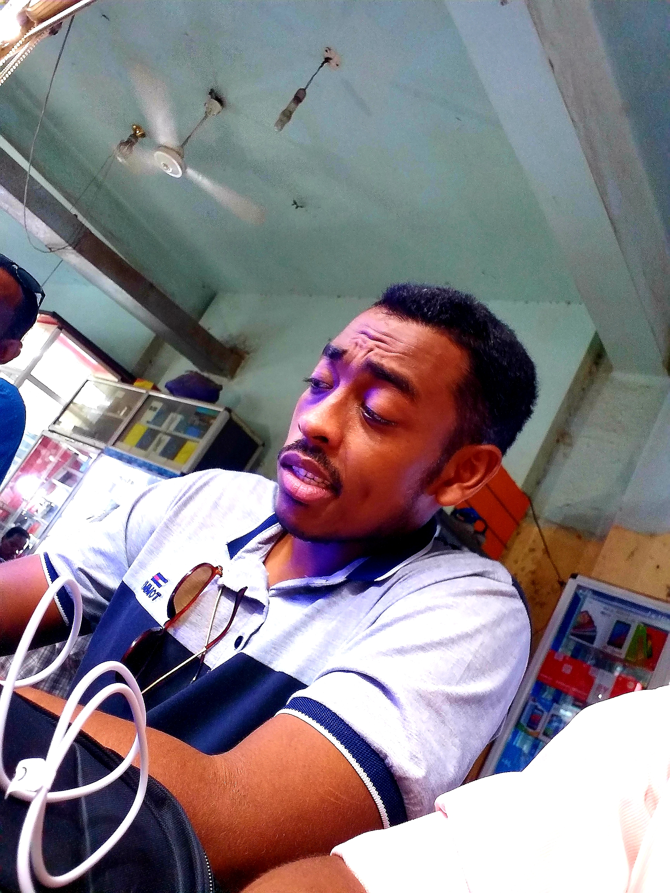

# Samir Omer

**Email**: samiromer2@yahoo.com

**Connect with me**  
- LinkedIn: https://www.linkedin.com/in/samir-omer-015bbb162/  
- Codecademy: https://www.codecademy.com/profiles/array6473567923

## When I’m instructing
1. Deliver tailored activities to individuals or small groups.  
2. Keep students engaged and on task.  
3. Support social and emotional development; report issues when needed.  
4. Help manage challenging behavior and promote positive behavior.  
5. Guide and monitor student progress.  
6. Assist with lesson planning.  
7. Handle administrative tasks (e.g., preparing resources).  
8. Share real-world tech experiences with students.  
9. Provide support outside the classroom.

## IT solutions
- Build web-based solutions for small to mid-sized companies (online/offline).
- Deploy and maintain Linux-based servers.

**Related roles**  
Web Developer, Systems Analyst, Database Administrator, Computer Programmer, Software Engineer, Software Developer.

## Projects
- Expo Snack: https://snack.expo.dev/@samiromer2/login-and-register  
- Mini book: https://samir-omer.gitbook.io/build-a-basic-computer-system-one-block-at-a-time/
